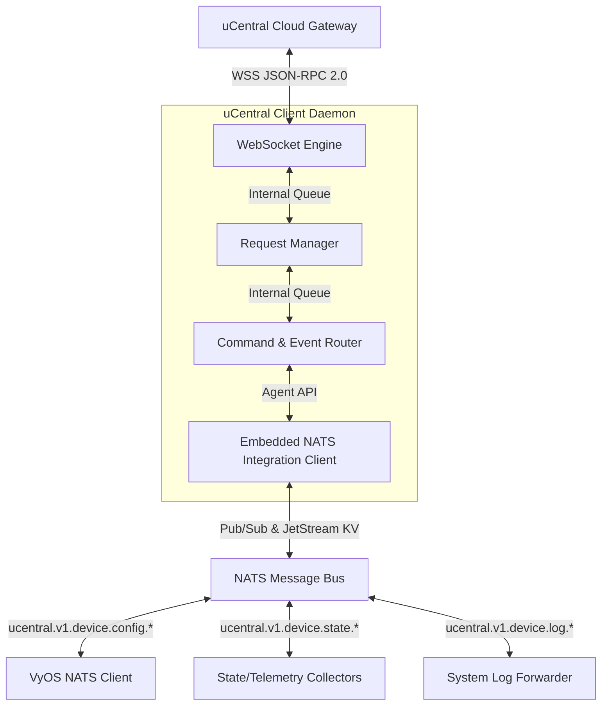
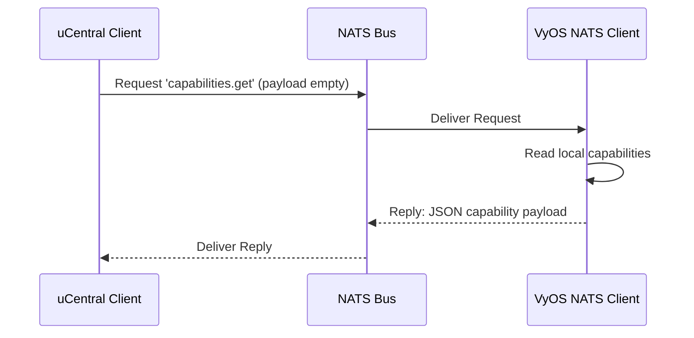
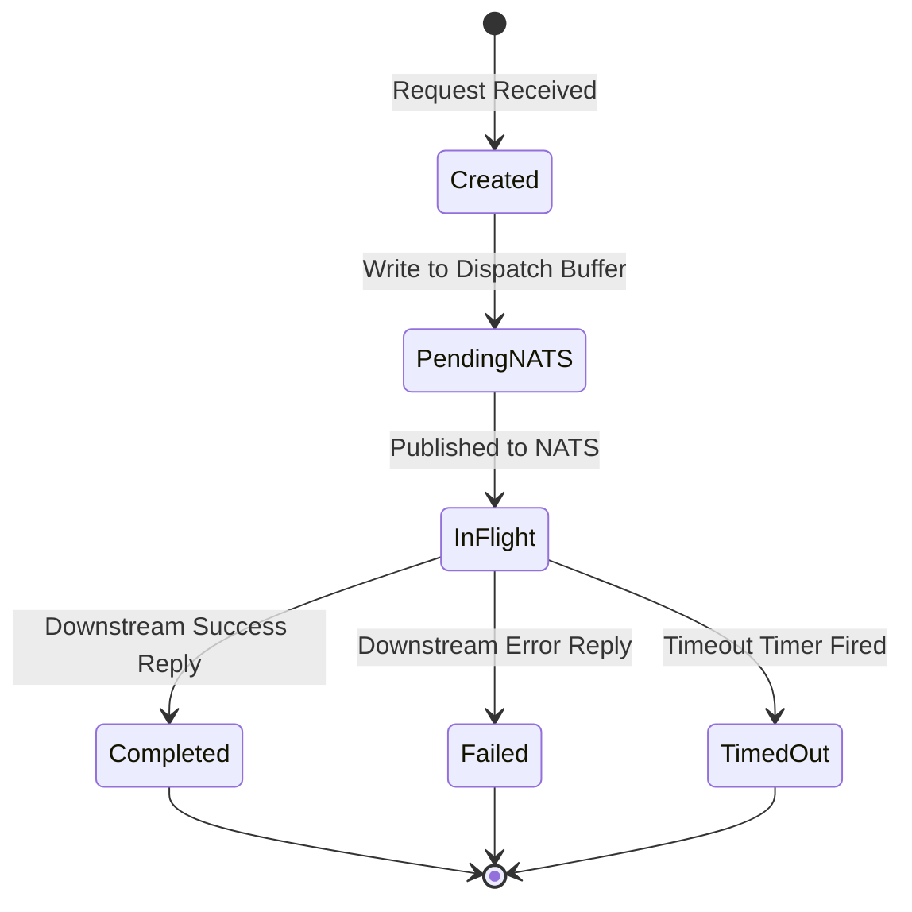
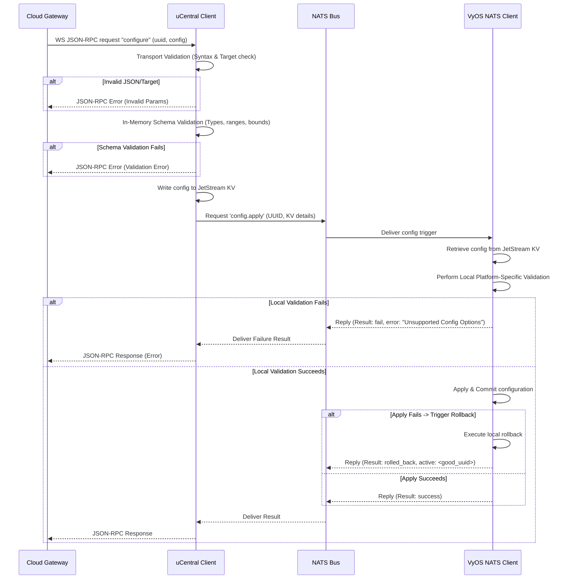
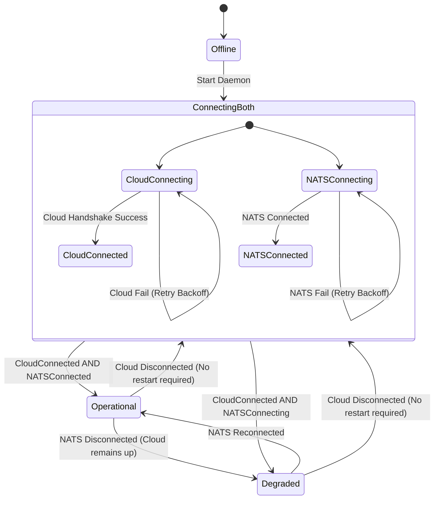

# High-Level Design: uCentral Client with NATS Integration (Language-Agnostic)

This document outlines the High-Level Design (HLD) for the **uCentral Client** (`olg-ucentral-client`). This client acts as a gateway/bridge between a cloud-based management platform (via the uCentral WebSocket/JSON-RPC protocol) and local device services (such as the VyOS NATS Client) using a local **NATS message bus**.

---

## 1. Architectural Overview

The uCentral client is a daemon that embeds a standard NATS agent library (modeled after the `nats-agent-core` specification). It acts as a **north-south proxy**, bridging the WAN Cloud interface with the LAN NATS bus. 

### Component Architecture



### 1.1 Ownership Boundaries
To avoid ambiguity between the uCentral client and downstream NATS microservices (such as the VyOS NATS Client), responsibilities are strictly divided as follows:

| Responsibility | Owning Component | Description |
| :--- | :--- | :--- |
| **Transport Validation** | uCentral Client | Checks JSON integrity, validates headers, and ensures the target serial matches the client config. |
| **Schema Parameter Validation** | uCentral Client | Validates incoming configuration payload values (parameter types, bounds, ranges, required fields) in-memory before NATS writes, using a compiled-in validator generated from the `olg-ucentral-schema` repository. **Permissive mode** is enforced: known fields are validated strictly, while unknown future fields are passed through to avoid tight coupling. |
| **Platform-Specific Translation** | Downstream Agent (e.g., VyOS Client) | Evaluates whether the valid schema properties are supported by the local system and translates them into system actions. |
| **Configuration Rollback**| Downstream Agent (e.g., VyOS Client) | Manages the configuration transaction; if an applied configuration fails connectivity or validation checks, the downstream agent performs a transaction rollback to the last known good configuration. |

### 1.2 Dedicated Request Manager
To decouple message routing from request lifecycles, the uCentral Client includes a **Request Manager** module responsible for:
*   **Correlation Tracking:** Maps outgoing NATS commands to incoming Cloud JSON-RPC requests using request IDs.
*   **Deduplication & Cache:** Handles duplicate requests and caches responses.
*   **Request Timeouts:** Enforces timeouts using non-blocking timers and triggers failure responses if local components do not respond in time.
*   **Retry Handling:** Automates transaction retries for transient failures.
*   **Metrics Collection:** Tracks latencies, throughputs, and success/error rates per command.

---

## 2. NATS & JetStream Interface

The client leverages standard structures, helper APIs, and connection wrappers defined in the NATS agent library.

### 2.1 Common Message Envelopes
To ensure interoperability, the uCentral client standardizes on standard envelopes:

#### Outgoing Configuration Envelope (ConfigureCommand / DesiredConfigRecord)
```json
{
  "version": "1.0",
  "rpc_id": "8bc92d11-536c-4860-9d8a-6809694b78ba",
  "target": "00:11:22:33:44:55",
  "uuid": "1687588800",
  "payload": { ... },
  "timestamp": "2026-06-25T12:00:00Z"
}
```

#### Outgoing Action Envelope (ActionCommand)
```json
{
  "version": "1.0",
  "rpc_id": "c138d6df-85f0-4322-927b-23fcfdf626c0",
  "target": "00:11:22:33:44:55",
  "command_type": "action",
  "action": "reboot",
  "payload": { ... },
  "timestamp": "2026-06-25T12:01:00Z"
}
```

#### Inbound Result Envelope (ResultEnvelope)
*Note:* The `uuid` field refers specifically to the Configuration UUID. It is populated only for `configure` commands and is omitted (empty) for transient action commands (such as `reboot` or `trace`).
```json
{
  "version": "1.0",
  "rpc_id": "8bc92d11-536c-4860-9d8a-6809694b78ba",
  "target": "00:11:22:33:44:55",
  "command_type": "configure",
  "uuid": "1687588800",
  "result": "success",
  "message": "Configuration applied and saved successfully.",
  "timestamp": "2026-06-25T12:00:15Z"
}
```

### 2.2 Correlation ID Propagation
The `rpc_id` field in all envelopes acts as the central correlation ID.
1.  When a Cloud JSON-RPC request is received, the WebSocket Engine extracts the `id`.
2.  The Request Manager populates the `rpc_id` field of the NATS payload with this ID.
3.  The downstream agent processes the command and returns a `ResultEnvelope` maintaining the exact same `rpc_id`.
4.  The Request Manager uses this correlation ID to match the incoming result and return the response to the correct WebSocket client thread/stream.

### 2.3 Versioned Subject Schema
To facilitate future protocol evolutions and enforce strict security boundaries, all NATS subjects are versioned under a `v1` prefix:

*   **Configure Trigger:** `ucentral.v1.device.<own-serial>.config.apply` (Request-Reply)
*   **Action Command:** `ucentral.v1.device.<own-serial>.action.<command>` (Request-Reply)
*   **State Publish:** `ucentral.v1.device.<own-serial>.state` (Pub-Sub)
*   **Telemetry Publish:** `ucentral.v1.device.<own-serial>.telemetry` (Pub-Sub)
*   **Log Publish:** `ucentral.v1.device.<own-serial>.log` (Pub-Sub)
*   **Health Publish:** `ucentral.v1.device.<own-serial>.health` (Pub-Sub)
*   **Capability Discovery:** `ucentral.v1.device.<own-serial>.capabilities.get` (Request-Reply)
*   **Status Query:** `ucentral.v1.device.<own-serial>.status.get` (Request-Reply)

*Security Boundary:* Read-only metadata calls (such as capability and status retrieval) are mapped to their own explicit subject namespaces, keeping them separate from destructive/operational `action.*` subjects. The daemon is restricted to `<own-serial>` topics to prevent cross-device actions.

### 2.4 Capability Discovery & Caching Flow
At startup, the client retrieves downstream device capabilities using the dedicated NATS query subject:



*   **Caching Strategy:** Dynamic capability configurations are fetched **exactly once** on daemon startup and cached in-memory. They are not re-fetched on NATS reconnect events to avoid traffic congestion.
*   **Refresh Events:** The cache is refreshed only:
    1. Upon detecting a firmware version change.
    2. Upon receipt of a specific system reboot log indicating an upgrade.
    3. If an explicit capability refresh event is received over a local Unix domain socket (restricted to root access).

### 2.5 JetStream Consistency Model
*   **Desired Configuration:** Leverages JetStream Key-Value (KV) store using `cfg_desired` bucket and key `desired.<serial>`. The client writes the desired state to KV, then publishes a lightweight trigger to the `config.apply` subject.
*   **Revision Match Contract:** The NATS configure trigger must include the `uuid`, `kv_key`, and the NATS `kv_revision` write metadata. The downstream agent reads the NATS trigger, retrieves the KV record, and compares revisions. 
    *   If the KV revision matches the trigger revision, it is applied.
    *   If the KV revision is higher than the trigger revision, the agent **aborts the stale trigger** and waits for the newer trigger to arrive. This prevents applying configs whose trigger publishes failed mid-sequence.
*   **Failure Handling:**
    *   *KV write succeeds but publish fails:* The client returns an error to the cloud. The updated configuration exists in KV but remains unapplied. Upon the next periodic sync check (or next cloud configure push), the client detects the UUID mismatch and publishes a notification to reconcile.
    *   *Publish succeeds but downstream agent cannot read KV:* The agent returns a NATS error payload. The Request Manager maps this to a configuration error response back to the cloud.

---

## 3. Workflows & Lifecycle Management

### 3.1 Request Manager Transaction State Machine
Every incoming Cloud command is modeled as an asynchronous transaction tracked by a state machine inside the Request Manager:



*   **Created:** Transaction metadata is initialized in memory, and the timeout timer is started.
*   **PendingNATS:** The request is queued in the NATS Dispatch Buffer.
*   **InFlight:** The message is published to NATS. The Request Manager listens for the matching `rpc_id` reply.
*   **Completed / Failed / TimedOut:** Terminal states. Once reached, the client replies to all registered cloud streams, updates metrics, caches the result, and cleans up transaction memory.

### 3.2 Concurrency & Serialization Rules
To protect device integrity, the client divides requests into two execution classes:

1.  **State-Changing Commands (Serialized):** Commands that modify device state (`configure`, `reboot`, `factory`, `upgrade`) are **serialized** (one at a time per device).
    *   *Rule:* If a state-changing transaction is currently `InFlight` or `PendingNATS`, any new configuration or action request (with a different `rpc_id`) is immediately rejected with a `busy` status (Error Code -32603 / Result: `busy`).
    *   *Benefit:* Eliminates the overhead of complex command queue backlogs and prevents race conditions.
2.  **Read-Only Commands (Parallel):** Metadata and query operations (`capabilities.get`, `status.get`) are **processed in parallel**.
    *   *Rule:* Query operations do not acquire the device state lock and are published to NATS immediately, even if a configuration transaction is in progress.

### 3.3 Duplicate & Overlapping Requests
*   **Overlapping Duplicate Requests:** If the Cloud retries a command sending the exact same `rpc_id` while a transaction is already `InFlight`, the client **does not send a second message to NATS**. Instead, it attaches the new WebSocket stream as a listener to the running transaction. When the agent completes execution, both waiting streams receive the same response.
*   **Duplicate Completed Requests:** If the request matches a cached `rpc_id` that has already completed, the Request Manager **replays the cached response** directly to the cloud.
*   **Cache TTL by Operation Type:**
    *   `configure`: **5 minutes**
    *   `reboot`: **10 minutes**
    *   `factory`: **30 minutes**
    *   `upgrade` (Firmware): **60 minutes** (or until terminal status is reached). Firmware upgrades are processed as **asynchronous actions**—the client returns an immediate "started" status and forwards progress updates to the cloud.

### 3.4 Behavior Across Reconnects
*   **Cloud Disconnections:** If the WAN connection to the Cloud drops while a transaction is `InFlight`, the client **continues running the operation downstream**. It does not abort the configuration or reboot.
*   **Result Recovery:** If NATS replies while the Cloud is disconnected, the client stores the result in its transaction cache. Once the Cloud reconnects and queries the status or retries the command (using the same `rpc_id`), the client replays the cached result immediately.

### 3.5 Timeout Specifications
To prevent hanging operations, the Request Manager enforces strict timeout thresholds:

*   **Configuration Apply Timeout:** **30 seconds**. If the downstream service does not return a configuration apply status within 30s, the client returns a timeout error to the cloud and logs a warning.
*   **Action Timeout:** **60 seconds** (default, action-specific configurations allowed, e.g., up to 120s for `wifiscan` or firmware download).
*   **NATS Publish Timeout:** **5 seconds**.


### 3.4 Configuration Validation & Application Flow
The validation pipeline splits structural checks from semantic checks:



#### 3.4.1 Configuration Rollback Reporting
When the downstream agent fails to apply a configuration and triggers a rollback, the status is propagated to the cloud as follows:
*   The downstream agent returns a result containing `result: rolled_back`, the failure details, and the `active` config UUID (the last known good configuration).
*   The uCentral Client translates this into a JSON-RPC response containing error code `1` (application error), a message stating `"Configuration apply failed. Rolled back to active configuration UUID <uuid>"`, and lists any offending rejected configuration keys.

### 3.5 Startup & Reconnect Dependency Handling
The client boots and connects to the Cloud and NATS **concurrently and independently** using separate background execution threads. Cloud connectivity does **not** block on NATS.



*   **Asynchronous Reconnection:** If the Cloud connection drops, the client enters the `ConnectingBoth` (CloudConnecting) state, attempting to reconnect in the background using backoff. **No daemon restart is required** for intermittent WAN outages.
*   **Independence:** The client attempts to establish a Cloud connection even if NATS is down or unconfigured. In this "NATS Down" state, the client reports its status as `Degraded` to the Cloud.
*   **Reconnect Backoff (Cloud):** 
    *   *Initial Delay:* **2 seconds**
    *   *Max Delay:* **300 seconds (5 minutes)**
    *   *Multiplier:* **2.0**
    *   *Jitter:* **Randomized Jitter of 10% to 20%** added to backoff intervals to prevent thundering herd issues on the uCentral gateway.

---

## 4. Traffic Flow & Queue Model

To protect system resources and prioritize messaging, the client utilizes a priority-based queue model:

```text
Incoming NATS/Cloud Traffic
   |
   +---> [Command Dispatch Buffer] ----> (NATS Handoff)
   +---> [Command Result Priority Queue] ----> [WebSocket Outbound Scheduler] <--- (Priority 0)
   +---> [State Coalescer] ----> (Coalesced Flush) ----> [WebSocket Outbound Scheduler] <--- (Priority 2)
   +---> [Telemetry/Log Ring Buffer] ---> (FIFO Queue) -> [WebSocket Outbound Scheduler] <--- (Priority 3)
```

### 4.1 Queue Specifications
Queue sizes are configurable via daemon configuration file parameters.

| Queue Name | Purpose / Type | Capacity | Overflow / Failure Policy |
| :--- | :--- | :--- | :--- |
| **Command Dispatch Buffer** | Short-lived NATS handoff buffer (Not durable). | Default: 100 messages | If full or NATS is disconnected, fails fast and rejects the Cloud request with `local_service_unavailable` (Error Code 3). |
| **Command Result Priority Queue** | Handles NATS replies for config/action processing. | Default: 50 messages | High priority. Never dropped. If capacity is threatened, telemetry forwarding is throttled. If full, triggers critical metrics alert and fails fast. |
| **State Coalescer** | Keeps only the latest state report (last-write-wins). | 1 Slot per Serial | Overwrites previous un-flushed stats with newer state reports. Flushes every 10 seconds. |
| **Telemetry/Log Ring Buffer** | Bounded FIFO queue for logs and events. | Default: 500 messages | Bounded FIFO. Drops oldest low-priority events on overflow (FIFO drop). Excludes high-severity audit logs. |

### 4.2 WebSocket Outbound Scheduler
Exposes a priority-aware message dispatch queue writing to the WebSocket connection. Commands responses are prioritized:
*   **Priority 0:** JSON-RPC responses and errors (always bypasses logs/telemetry backlog).
*   **Priority 1:** Critical audits, system crash logs, and health snapshots.
*   **Priority 2:** Coalesced device state reports.
*   **Priority 3:** Standard telemetry events and syslog logs.

### 4.3 Rate Limiting & Sizing Constraints
*   State updates (statistics) are rate-limited to a maximum of **one message per 10 seconds** per device.
*   Telemetry events are rate-limited to **50 events per second**.
*   **Max payload sizes:** Configuration: 10MB; State: 1MB; Telemetry events: 256KB; Log events: 64KB. Payloads exceeding these limits are discarded.

---

## 5. Security Architecture

### 5.1 NATS Security Configuration
*   **Authentication:** Authenticates with the NATS bus using **NKeys/Seed files** or **JWT Tokens** specified in the daemon configuration file.
*   **TLS Requirements:** TLS v1.3 is enforced on the NATS connection with CA certificates validation.
*   **Authorization & Access Control (ACLs):** The client runs under restricted NATS credentials enforcing target isolation:
    *   *Publish:* `ucentral.v1.device.<own-serial>.config.apply`, `ucentral.v1.device.<own-serial>.action.*`
    *   *Subscribe:* `ucentral.v1.device.<own-serial>.state`, `ucentral.v1.device.<own-serial>.telemetry`, `ucentral.v1.device.<own-serial>.log`, `ucentral.v1.device.<own-serial>.health`
    
    *Security Constraint:* The client is explicitly restricted from accessing wildcard subjects `ucentral.v1.device.*` to prevent accidental cross-device actions.

### 5.2 Action Command Authorization & Auditing
*   **NATS ACLs:** Only the uCentral client is authorized to publish to `ucentral.v1.device.<own-serial>.action.*`. Downstream agents are prohibited from publishing to these topics.
*   **Audit Logging:** Every sensitive Action Command (e.g., `reboot`) is logged locally in the system audit stream and sent back to the cloud as a high-severity `log` request containing the `rpc_id` and the user/system identity that triggered it. *(Note: This is a new security feature introduced in this client and is not present in the legacy OpenWrt client).*
*   **Recursive Loop Prevention:** If the audit log forwarding fails, the client increments the `audit_delivery_failure` metric but **does not generate another log** to prevent recursive log flooding.

---

## 6. Operational Observability & Health Reporting (NATS-Native)

To keep the daemon resource-efficient and secure, it does **not** expose local HTTP ports (such as Prometheus or health endpoints) on the router VM. Monitoring and health checks are integrated directly into NATS.

### 6.1 NATS Health Reporting
The embedded NATS client periodically publishes its health metrics directly to the NATS bus on:
`ucentral.v1.device.<own-serial>.health`

The payload matches the `HealthSnapshot` envelope defined by the NATS agent library:

```json
{
  "state": "connected",
  "connected_url": "nats://127.0.0.1:4222",
  "jetstream_ready": true,
  "kv_ready": true,
  "registered_subscriptions": 4,
  "active_subscriptions": 4,
  "last_error": ""
}
```

### 6.2 NATS Status Endpoint (Liveness vs Readiness)
The uCentral client listens for status queries on the request-reply topic:
`ucentral.v1.device.<own-serial>.status.get`

Upon receiving a request, the client replies with its status snapshot. Standard watchdog scripts or VM hypervisors can query this subject using standard NATS request tools to determine the liveness and readiness of the daemon:

```json
{
  "status": "healthy",
  "liveness": "ok",
  "readiness": "ready",
  "cloud": "connected",
  "nats": "connected",
  "uptime": 345600,
  "version": "1.0.0",
  "metrics": {
    "queue_depth": 0,
    "dropped_messages": 0,
    "dropped_by_reason": {
      "rate_limited": 0,
      "queue_full": 0,
      "cloud_disconnected": 0
    },
    "last_error": ""
  }
}
```
*   **Liveness (`liveness`):** `ok` as long as the uCentral Client daemon process is running and executing its main loop.
*   **Readiness (`readiness`):** `ready` if NATS and Cloud are both connected; `degraded` if NATS is down or Cloud is disconnected. Helper tools use this to routes traffic.

---

## 7. Version Compatibility & Negotiation

*   **Coexistence:** Multiple version namespaces (e.g., `v1` and `v2`) can coexist on the same NATS broker. Different implementations subscribe to their specific major version prefix.
*   **Backward Compatibility:** Within a major version namespace, backward compatibility is required. Undefined fields must be ignored by consumers, and new optional fields must be defined with safe defaults.
*   **Version Negotiation & Fallback:** During the `connect` handshake, the uCentral client exchanges its supported subject versions (e.g. `v1`) within the `capabilities` payload. The Cloud gateway uses this information to format messages accordingly.
    *   *Fallback rule:* If the Cloud supports `v2` only but the client supports `v1` only (or vice versa), the client remains connected but operates **only in a degraded state for health/error reporting**, rejecting all configuration and action requests with error code 3 (`local_service_unavailable`).

---

## 8. Appendix: Enums & Error Mappings

### 8.1 JSON-RPC Error Codes
The client maps internal failures to standard JSON-RPC 2.0 error codes:

| Error Code | Name | Description |
| :--- | :--- | :--- |
| **-32700** | Parse Error | Invalid JSON received by client. |
| **-32600** | Invalid Request | JSON-RPC request is malformed. |
| **-32601** | Method Not Found | The requested JSON-RPC method does not exist. |
| **-32602** | Invalid Params | Target serial mismatch, invalid UUID, or missing parameters. |
| **-32603** | Internal Error | Internal uCentral client daemon exception. |
| **1** | Application Error | Configuration apply failed locally on the agent. |
| **2** | Timeout | Command execution exceeded time limits (NATS timeout). |
| **3** | Local Service Unavailable| NATS is disconnected or no downstream agent is listening. |
| **4** | Validation Failed | Schema check failed at the uCentral client validator. |
| **5** | Rollback Completed | Configuration failed but rollback to previous UUID succeeded. |
| **6** | Rollback Failed | Configuration failed and rollback to previous UUID also failed. |

### 8.2 Result Enums
All result structures return one of the following standard values:

*   `success`: Command processed and applied successfully.
*   `rejected`: Command failed validation checks (non-destructive).
*   `failed`: Command failed during execution (destructive).
*   `timeout`: Command timed out on NATS or local apply.
*   `rolled_back`: Config apply failed; device successfully rolled back to last good UUID.
*   `rollback_failed`: Config apply failed and rollback also failed.
*   `stale`: A newer configuration revision has overwritten this trigger.
*   `busy`: A transaction is currently executing on this resource.
*   `unsupported`: The requested operation is not supported by the downstream agent.
